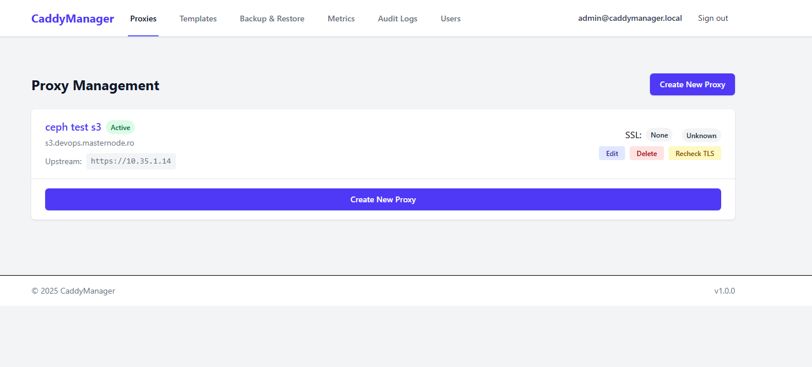

# CaddyManager

[](https://opensource.org/licenses/Apache-2.0)
[](https://github.com/rhad00/CaddyManager/issues)
[](https://github.com/rhad00/CaddyManager/stargazers)
[](https://hub.docker.com/r/rhad00/CaddyManager)

**CaddyManager** is the modern, hassle-free way to manage your reverse proxy. Built on the powerful **Caddy Server**, it gives you a beautiful UI to manage domains, SSL certificates, and complex headers without touching a single config file.

**Stop debugging Nginx syntax. Start deploying services.**



> [!NOTE]
> This project is currently in **Alpha**. While we use it daily, please test thoroughly in your environment.

## ✨ Why CaddyManager?

### 🔌 "One-Click" Service Templates
Deploying complex apps like **Authelia**, **Keycloak**, or **Nextcloud**? Forget about manually configuring `X-Forwarded-*` headers or debugging infinite redirect loops.

CaddyManager includes **battle-tested templates** for these services. Just select "Authelia" from the dropdown, and we apply the perfect configuration automatically.
*   **Supported Templates:** Authelia, Keycloak, Amazon S3 (MinIO/Ceph), Nextcloud, Cloudflare Tunnel, Grafana, Kibana.

### 🔒 Zero-Config Cloudflare DNS Challenges
Want wildcard certificates or need to secure internal services without opening port 80?

Just provide your **Cloudflare API Token**. CaddyManager automatically configures Caddy's **DNS-01 challenge**.
*   No plugins to install.
*   No scripts to run.
*   **It just works.**

### 🛡️ Enterprise-Grade Security
Security shouldn't be optional. Enable industry-standard security headers with a single toggle:
*   **HSTS** (Strict-Transport-Security)
*   **CSP** (Content-Security-Policy)
*   **X-Frame-Options** & **X-Content-Type-Options**
*   **IP Filtering** (Allow/Block lists) & **Rate Limiting**

### 💾 Automatic Backups
Your configuration is precious. CaddyManager automatically backs up your proxy settings, routes, and certificates.
*   **Auto-Backup**: Scheduled backups of your entire config.
*   **Instant Restore**: Rollback to any previous state directly from the UI.
*   **Portable**: Export your config and move to a new server in seconds.

## 🚀 Features Overview

| Feature | Description |
|---------|-------------|
| **User Management** | JWT-based auth, Role-based access (Admin/ReadOnly), Brute-force protection. |
| **Proxy Management** | Multi-domain support, Auto-SSL (Let's Encrypt), Custom Certs, HTTP->HTTPS redirects. |
| **Advanced Routing** | Path-based routing, Compression (Gzip/Zstd), WebSocket support. |
| **Monitoring** | System health checks, Real-time status updates. |

## How It Works

### Initial Setup and Caddyfile
The application uses a base Caddyfile for initial startup that:
- Configures the Admin API endpoint on port 2019 (accessible only from internal network)
- Disables automatic HTTPS redirects initially
- Sets up file system storage for certificates and data
- Provides default placeholder responses on ports 80 and 443

On startup, the CaddyService:
1. Checks for an existing configuration backup
2. If a backup exists, loads it
3. If no backup exists but there are proxies in the database, rebuilds the configuration
4. If neither exists, uses the default Caddyfile configuration

### Template System
The application includes pre-configured templates for common services:
- Authelia (Authentication server)
- Keycloak (Identity management)
- Amazon S3 compatible services (MiniIO, Ceph RadosGW) (Storage service)
- Nextcloud (Self-hosted productivity)
- Cloudflare Tunnel
- Grafana (Monitoring platform)
- Kibana/Elastic (Dashboard)

Each template includes:
- Predefined headers for proper service functionality
- Middleware configurations (if required)
- Specific routing rules

Templates can be applied to proxies to automatically configure:
- Request/response headers
- Authentication settings
- Rate limiting
- IP filtering
- Path rewrites

### Header Management
Headers are managed through a flexible system that supports:
- Request and response header types
- Dynamic values using Caddy placeholders
- Template-based header inheritance
- Per-proxy custom headers

Example header configurations:

1. Authentication header from Authelia template:
```javascript
{
  header_type: 'request',
  header_name: 'x-original-uri',
  header_value: '{http.request.uri}'
}
```

2. Security header (automatically applied when security headers are enabled):
```javascript
{
  header_type: 'response',
  header_name: 'Strict-Transport-Security',
  header_value: 'max-age=31536000; includeSubDomains; preload',
  enabled: true
}
```


## 🚀 Features

### Core Features
- **Authentication & User Management**
  - JWT-based authentication with secure password hashing
  - Role-based access control (Admin, Read-only)
  - Brute-force protection with rate limiting
  - Initial admin setup automation

- **Proxy Host Management**
  - Multi-domain support
  - Automatic SSL via Let's Encrypt
  - Custom SSL certificate management
  - Advanced routing options
  - HTTP to HTTPS redirection
  - Compression options (gzip/zstd)

- **Header & Middleware Configuration**
  - Custom header injection (request/response)
  - One-click security headers configuration:
    - Strict-Transport-Security (HSTS) for enhanced transport security
    - X-Content-Type-Options to prevent MIME-type sniffing
    - X-Frame-Options to control frame embedding
    - Content-Security-Policy for XSS prevention
    - Referrer-Policy to control referrer information
    - Permissions-Policy to manage browser features
  - Rate limiting middleware
  - IP filtering (allow/block lists)
  - Basic authentication
  - Path-based routing

### Advanced Features
- **Service Templates**
  - Predefined templates for:
    - Amazon S3
    - Authelia
    - Keycloak
    - Nextcloud
    - Cloudflare Tunnel
    - Grafana
    - Kibana/Elastic
  - Custom template creation (to do)
  - Template merging with headers (to do)

- **Backup & Restore**
  - Configuration export/import
  - Automated backups (to do)
  - SSL certificate backup (to do)
  - Optional S3 cloud backup (to do)
  - Encrypted local backups (to do)

- **Monitoring & Security**
  - System health monitoring
  - Access and error logging (to do)
  - Comprehensive security features (CrowdSec / mod_security) (to do)

## Implementation Details

### Proxy Management
- Each proxy is stored in the database with:
  - Domain configuration
  - SSL settings
  - Upstream URL
  - Security headers configuration
  - Associated headers and middleware
- Changes trigger automatic Caddy configuration updates via Admin API
- Configuration backups are maintained for reliability

### Configuration Persistence
- Configurations are stored in both the database and Caddy
- Automatic backup system maintains config_backups/caddy_config_backup.json which can be mounted as local folder in docker or in a volume
- Configuration is rebuilt from database on service restart
- Handles both HTTP and HTTPS proxies with proper SSL termination (ACME Let's Encrypt without user intervention)

### Template Implementation
Templates simplify service configuration through:
1. Predefined header sets for common services
2. Middleware configurations (rate limiting, auth, etc.)
3. Path-based routing rules
4. SSL and compression settings

Example template usage in code:
```javascript
await caddyService.applyTemplate(proxy, template);
// Applies all template headers and middleware
// Updates Caddy configuration automatically
```

## 🛠 Technology Stack

### Backend
- **Runtime**: Node.js 20.x LTS
- **Framework**: Express.js
- **Database**: PostgreSQL with Sequelize ORM
- **Authentication**: JWT with Passport.js
- **API Documentation**: Swagger/OpenAPI
- **Testing**: Jest, Supertest

### Frontend
- **Framework**: React 18+
- **Build Tool**: Vite
- **UI Framework**: TailwindCSS + ShadCN UI
- **State Management**: React Context API + React Query
- **Form Handling**: React Hook Form
- **Testing**: Vitest + React Testing Library

### Infrastructure
- **Container**: Docker & Docker Compose
- **Reverse Proxy**: Caddy 2.x
- **CI/CD**: GitHub Actions
- **Monitoring**: Prometheus + Grafana (optional)

## 🚀 Quick Start

CaddyManager offers three deployment configurations to suit different needs:

### Deployment Options Overview

| Configuration | Database | Use Case | Ports | Command |
|--------------|----------|----------|-------|---------|
| **Default** (`docker-compose.yml`) | SQLite | Small deployments, testing | Caddy: 80/443, Backend: 3000, Frontend: 8080 | `docker-compose up -d` |
| **Development** (`docker-compose.dev.yaml`) | SQLite | Development, debugging | Caddy: 80/443/2019, Backend: 3000, Frontend: 8080 | `docker-compose -f docker-compose.dev.yaml up -d` |
| **Production** (`docker-compose.prod.yml`) | PostgreSQL | Production, high-traffic | Caddy: 80/443, Backend: 3000, Frontend: 8080 | `docker-compose --env-file .env.prod -f docker-compose.prod.yml up -d` |

### 1. Default Deployment (SQLite - Recommended for Small Scale)

**Best for:** Personal use, small teams, testing, low-traffic sites

**Features:**
- SQLite database (no separate DB container needed)
- Simple setup with minimal configuration
- All data stored in Docker volumes
- Caddy handles SSL/TLS on ports 80/443
- Frontend accessible on port 8080
- Backend API on port 3000

**Quick Start:**

1. Clone the repository:
```bash
git clone https://github.com/rhad00/CaddyManager.git
cd CaddyManager
```

2. (Optional) Set JWT secret:
```bash
export JWT_SECRET=your_secure_random_string_here
```

3. Start the application:
```bash
docker-compose up -d
```

4. Access the application:
   - **Frontend UI**: http://localhost:8080
   - **Caddy Proxy**: http://localhost (ports 80/443)
   - **Backend API**: http://localhost:3000

5. **Login with default credentials:**
   - **Email**: `admin@caddymanager.local`
   - **Password**: `changeme123`
   - ⚠️ **IMPORTANT**: Change the default password immediately after first login!

**Customizing Admin Credentials:**

To set custom admin credentials on first startup, set these environment variables:

```bash
export ADMIN_EMAIL=your-email@example.com
export ADMIN_PASSWORD=your-secure-password
docker-compose up -d
```

Or add them to your docker-compose.yml:
```yaml
backend:
  environment:
    - ADMIN_EMAIL=your-email@example.com
    - ADMIN_PASSWORD=your-secure-password
```

### 2. Development Deployment (SQLite)

**Best for:** Active development, debugging, testing new features

**Features:**
- SQLite database for simplicity
- Source code mounted for live reload
- Caddy Admin API exposed on port 2019
- Debug logging enabled
- All ports exposed for direct access

**Quick Start:**

1. Clone and navigate:
```bash
git clone https://github.com/rhad00/CaddyManager.git
cd CaddyManager
```

2. Start development environment:
```bash
docker-compose -f docker-compose.dev.yaml up -d
```

3. Access the application:
   - **Frontend UI**: http://localhost:8080
   - **Backend API**: http://localhost:3000
   - **Caddy Proxy**: http://localhost (ports 80/443)
   - **Caddy Admin API**: http://localhost:2019

4. **Login with default credentials:**
   - **Email**: `admin@caddymanager.local`
   - **Password**: `changeme123`
   - ⚠️ **IMPORTANT**: Change the default password immediately after first login!

### 3. Production Deployment (PostgreSQL - Recommended for Scale)

**Best for:** Production environments, high-traffic sites, enterprise deployments

**Features:**
- PostgreSQL database for reliability and performance
- Optimized for production workloads
- Environment-based configuration
- Secure defaults
- Caddy handles SSL/TLS on ports 80/443

**Quick Start:**

1. Clone the repository:
```bash
git clone https://github.com/rhad00/CaddyManager.git
cd CaddyManager
```

2. Create production environment file:
```bash
cp .env.prod.example .env.prod
```

3. Edit `.env.prod` with your production values:
```bash
# Required: Database password
DB_PASSWORD=your_secure_production_password

# Required: JWT secret (use a long random string)
JWT_SECRET=your_production_jwt_secret_change_this_in_production_12345678901234567890

# Optional: Customize these if needed
DB_NAME=caddymanager
DB_USER=caddyuser
JWT_EXPIRES_IN=24h
LOG_LEVEL=info
```

4. Start the application:
```bash
docker-compose --env-file .env.prod -f docker-compose.prod.yml up -d
```

5. Access the application:
   - **Frontend UI**: http://localhost:8080
   - **Caddy Proxy**: http://localhost (ports 80/443)
   - **Backend API**: http://localhost:3000

6. **Login with default credentials:**
   - **Email**: `admin@caddymanager.local`
   - **Password**: `changeme123`
   - ⚠️ **IMPORTANT**: Change the default password immediately after first login!

### Port Reference

All deployment configurations use consistent port mappings:

- **80/443**: Caddy reverse proxy (handles your proxied services)
- **3000**: Backend API (CaddyManager API)
- **8080**: Frontend UI (CaddyManager web interface)
- **2019**: Caddy Admin API (development only, internal use)
- **5432**: PostgreSQL (production only, not exposed by default)

## 📋 Environment Variables Reference

### Backend Environment Variables

All backend environment variables can be set in `.env` files or passed directly to Docker.

#### Database Configuration

| Variable | Default | Description | Required |
|----------|---------|-------------|----------|
| `DB_TYPE` | `sqlite` | Database type: `sqlite` or `postgres` | No |
| `SQLITE_PATH` | `./database.sqlite` | Path to SQLite database file | No (SQLite only) |
| `DB_HOST` | `localhost` | PostgreSQL host | Yes (PostgreSQL) |
| `DB_PORT` | `5432` | PostgreSQL port | No |
| `DB_NAME` | `caddymanager` | Database name | Yes (PostgreSQL) |
| `DB_USER` | `caddyuser` | Database username | Yes (PostgreSQL) |
| `DB_PASSWORD` | - | Database password | Yes (PostgreSQL) |
| `DB_SSL` | `false` | Enable SSL for database connection | No |
| `DB_URL` | - | Full database connection URL (overrides individual settings) | No |

#### Application Configuration

| Variable | Default | Description | Required |
|----------|---------|-------------|----------|
| `NODE_ENV` | `development` | Environment: `development`, `production`, or `test` | No |
| `PORT` | `3000` | Backend server port | No |
| `LOG_LEVEL` | `info` | Logging level: `error`, `warn`, `info`, `debug` | No |

#### Authentication Configuration

| Variable | Default | Description | Required |
|----------|---------|-------------|----------|
| `JWT_SECRET` | - | Secret key for JWT token signing (use long random string) | **Yes** |
| `JWT_EXPIRES_IN` | `24h` | JWT token expiration time (e.g., `24h`, `7d`, `30m`) | No |
| `ADMIN_EMAIL` | `admin@caddymanager.local` | Initial admin user email (created on first startup if no users exist) | No |
| `ADMIN_PASSWORD` | `changeme123` | Initial admin user password (created on first startup if no users exist) | No |

#### Caddy Configuration

| Variable | Default | Description | Required |
|----------|---------|-------------|----------|
| `CADDY_API_URL` | `http://caddy:2019` | Caddy Admin API endpoint (use `http://caddy:2019` in Docker, `http://localhost:2019` for local dev) | No |
| `CF_API_TOKEN` | - | Cloudflare API token used for DNS-01 challenges when issuing certificates via Cloudflare DNS. Set this to enable Cloudflare DNS challenge support in Caddy and to surface the Cloudflare option in the frontend UI. | No |

### Frontend Environment Variables

| Variable | Default | Description | Required |
|----------|---------|-------------|----------|
| `VITE_API_URL` | `/api` | Backend API URL (use `/api` for Docker deployments as NGINX proxies to backend, `http://localhost:3000/api` for local dev without Docker) | No |

### Example Configurations

#### Minimal SQLite Setup (Default/Dev)
```bash
JWT_SECRET=your_random_secret_key_here
```

#### Full PostgreSQL Setup (Production)
```bash
# Database
DB_PASSWORD=secure_password_here
DB_NAME=caddymanager
DB_USER=caddyuser

# Authentication
JWT_SECRET=your_production_jwt_secret_change_this_12345678901234567890
JWT_EXPIRES_IN=24h

# Application
NODE_ENV=production
LOG_LEVEL=info
```

### Manual Installation

For development without Docker:

1. Clone the repository:
```bash
git clone https://github.com/rhad00/CaddyManager.git
cd CaddyManager
```

2. Install dependencies:
```bash
# Backend
cd backend
npm install

# Frontend
cd ../frontend
npm install
```

3. Configure environment:
```bash
cp backend/.env.example backend/.env
cp frontend/.env.example frontend/.env
```

4. Edit `backend/.env` with required values:
```bash
# Minimal configuration for local development
NODE_ENV=development
PORT=3000
DB_TYPE=sqlite
SQLITE_PATH=./database.sqlite
JWT_SECRET=dev_secret_key_change_in_production
CADDY_API_URL=http://localhost:2019  # Use localhost for manual installation
```

5. Edit `frontend/.env` with required values:
```bash
# Frontend configuration for local development
VITE_API_URL=http://localhost:3000/api  # Use full URL for manual installation (no NGINX proxy)
```

6. Start development servers:
```bash
# Backend (in backend directory)
npm run dev

# Frontend (in frontend directory, separate terminal)
npm run dev
```

**Note:** 
- **Docker deployments**: Frontend uses `VITE_API_URL=/api` (NGINX proxies `/api` to backend container). Backend uses `CADDY_API_URL=http://caddy:2019` (container name).
- **Manual/local development**: Frontend uses `VITE_API_URL=http://localhost:3000/api` (direct connection). Backend uses `CADDY_API_URL=http://localhost:2019` (localhost).

## 📝 Documentation

### Cloudflare DNS Challenge (Optional)

You can enable Cloudflare DNS-01 challenge support so Caddy can obtain/renew certificates using Cloudflare's DNS API. When enabled, the frontend UI will show a `Cloudflare DNS` option in the SSL type dropdown for proxies.

#### Important: API Token vs API Key

**⚠️ CRITICAL:** Caddy's Cloudflare DNS provider **only supports API Tokens**, not the legacy Global API Keys.

**Authentication Methods Comparison:**

| Method | Caddy Support | Traefik Support | Security | Recommended |
|--------|---------------|-----------------|----------|-------------|
| **API Token** (Modern) | ✅ Yes | ✅ Yes | ✅ Scoped permissions | ✅ **Use This** |
| **Global API Key** (Legacy) | ❌ No | ✅ Yes | ⚠️ Full account access | ❌ Don't Use |

**Why This Matters:**
- If you're migrating from Traefik or another reverse proxy that uses `CF_API_KEY` + `CF_API_EMAIL`, you **must** generate a new API Token
- Using a Global API Key will result in the error: `Invalid format for Authorization header`
- Caddy uses the `libdns/cloudflare` library which explicitly does not support legacy API keys

#### How to Enable Cloudflare DNS Challenge

**Step 1: Generate a Cloudflare API Token**

1. Go to https://dash.cloudflare.com/profile/api-tokens
2. Click **"Create Token"**
3. Use the **"Edit zone DNS"** template
4. Configure permissions:
   - **Zone - Zone - Read** (for all zones)
   - **Zone - DNS - Edit** (for all zones OR specific zones you want to manage)
5. Click **"Continue to summary"** → **"Create Token"**
6. **COPY THE TOKEN IMMEDIATELY** (40 characters, shown only once)

**Step 2: Set the Environment Variable**

Add the API token to your `.env` file or docker-compose configuration:

```bash
# .env file
CF_API_TOKEN=your_40_character_api_token_here
```

**Step 3: Restart Services**

```bash
docker-compose restart caddy backend
```

#### Verification

After setting up the API token:

1. The frontend UI will automatically show the `Cloudflare DNS` option in the SSL type dropdown
2. When creating/editing a proxy, select `Cloudflare DNS` as the SSL type
3. Caddy will use DNS-01 challenge to obtain certificates automatically
4. Monitor logs for successful certificate acquisition:
   ```bash
   docker-compose logs -f caddy
   ```

#### Troubleshooting

**Error: `Invalid format for Authorization header`**
- **Cause:** You're using a Global API Key instead of an API Token
- **Solution:** Generate a new API Token following the steps above

**Error: `timed out waiting for record to fully propagate`**
- **Cause:** DNS resolver caching or network issues
- **Solution:** Add custom DNS resolvers in your Caddy configuration (e.g., `1.1.1.1`)

**Error: `expected 1 zone, got 0`**
- **Cause:** Domain not publicly resolvable or incorrect token permissions
- **Solution:** Verify domain is publicly accessible and token has correct zone permissions

#### Notes

- The backend exposes a `GET /api/features` endpoint to detect Cloudflare support availability
- If `CF_API_TOKEN` is present in the environment, the frontend will surface the Cloudflare option automatically
- Treat `ssl_type: cloudflare` the same as `acme` for certificate issuance
- The actual DNS challenge handling is performed by Caddy using the token you provide
- API Tokens are more secure than Global API Keys as they have scoped permissions and can be revoked independently


- [Deployment Guide](./docs/DEPLOYMENT.md) - Complete deployment and troubleshooting guide
- [Getting Started Guide](./docs/getting_started.md)
- [Development Roadmap](./docs/development_roadmap.md)
- [Technology Stack Details](./docs/technology_stack.md)
- [Project Structure](./docs/project_structure.md)
- [API Documentation](https://api-docs.caddymanager.org)
- [Contributing Guidelines](./CONTRIBUTING.md)
- [Code of Conduct](./docs/CODE_OF_CONDUCT.md)

## 🗺 Roadmap

### Wish list
- Enhanced monitoring capabilities
- Additional service templates
- Advanced analytics dashboard
- Multi-language support
- Plugin system for extensions
- Multi-node Caddy management
- Advanced backup strategies
- Enhanced security features
- Clustering and high availability
- Enterprise features (LDAP/SAML)

## 👥 Contributing

We welcome contributions! Please see our [Contributing Guidelines](CONTRIBUTING.md) for details.

1. Fork the repository
2. Create your feature branch:
   ```bash
   git checkout -b feature/amazing-feature
   ```
3. Commit your changes:
   ```bash
   git commit -m 'Add amazing feature'
   ```
4. Push to the branch:
   ```bash
   git push origin feature/amazing-feature
   ```
5. Open a Pull Request

## 🐛 Bug Reports & Feature Requests

Please use the [GitHub issue tracker](https://github.com/rhad00/CaddyManager/issues) to report bugs or suggest features.

When reporting bugs, please include:
- Detailed description of the issue
- Steps to reproduce
- Expected vs actual behavior
- CaddyManager version
- Environment details (OS, Docker version if applicable)
- Relevant logs or screenshots

## 📄 License

This project is licensed under the Apache License 2.0 - see the [LICENSE](LICENSE) file for details.

## 🙏 Acknowledgments

- [Caddy Server](https://caddyserver.com/) for the amazing reverse proxy
- [NPMPlus](https://github.com/nginx-proxy-manager/nginx-proxy-manager) for inspiration
- All our [contributors](https://github.com/rhad00/CaddyManager/graphs/contributors)

---

<p align="center">Made with ❤️ by the CaddyManager Team</p>
